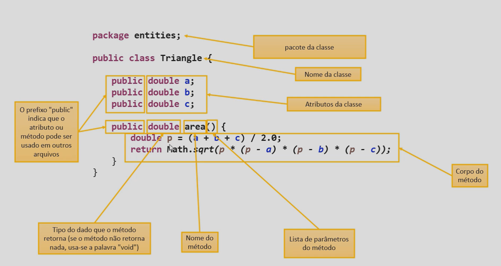

# Introdução à Programação Orientada a Objetos

POO é um paradigma de programação que utiliza objetos para representar entidades do mundo real.<br>
POO melhora a organização do código, facilita a manutenção e reutilização do código.<br>
POO ajuda na alocação em memória, pois cria objetos alocados na memória.

## Classes

Classes podem conter Atributos e Métodos.

### Atributos

- Características do Objeto
- Dados
- Campos

Atributos são variáveis que representam as características do Objeto.

### Métodos

- Ações do objeto
- Funções
- Comportamentos

Métodos são funções que representam as ações do Objeto.

## Exemplo

### Classe Ninja

```Java
public class Ninja {
    String nome;
    String aldeia;
    String cla;
    String jutsu;

    public void ataqueBasico() {
        System.out.println("Kunai");
    }
}
```

## POO na praticá / Exemplo de Classe



**Métodos Object**

- toString() = Transforma a variavel em String
- equals() = Compara se dois objetos são iguais
- hashCode() = Retorna um valor inteiro que representa o objeto
- getClass() = Retorna a classe do objeto

**Conceitos POO**

- Encapsulamento = Proteger os atributos de uma classe para que não sejam acessados diretamente 
Exemplo de encapsulamento:
```Java
public class Ninja {
    private String nome;
    private String aldeia;
    private String cla;
    private String jutsu;
}
``` 
- Herança = Permite que uma classe herde atributos e métodos de outra classe
```Java
public class Uzumaki extends Ninja {
}
```
- Polimorfismo = Permite que um objeto seja tratado de várias formas
```Java
public class Uchiha extends Ninja {
    public void ataqueBasico(int nivelChakra) {
        if (nivelChakra > 50) {
            System.out.println("Susano'o");
        } else if (nivelChakra > 30) {
            System.out.println("Sharingan");
        } else {
            System.out.println("Kunai");
        }
    }
}
```
- Abstração = Permite que uma classe seja abstrata, ou seja, não pode ser instanciada
```Java
public abstract class Jutsu {
    public abstract void ataque();
}
```
- Interface = Permite que uma classe implemente métodos de uma interface
```Java
public interface Jutsu {
    public void ataque();
}
```