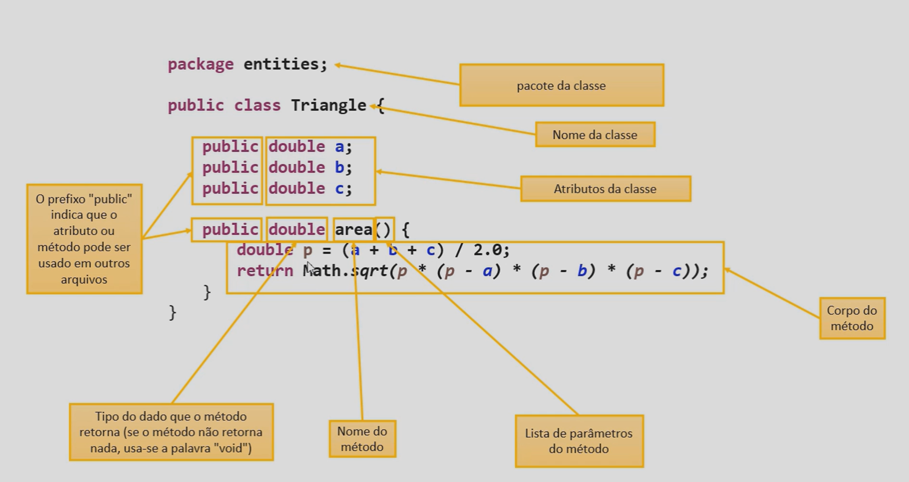

# Introdução à Programação Orientada a Objetos

POO é um paradigma de programação que utiliza objetos para representar entidades do mundo real. 
POO melhora a organização do código, facilita a manutenção e reutilização do código. 
POO ajuda na alocação em memória, pois cria objetos alocados na memória.

## Classes

Classes podem conter Atributos e Métodos.

### Atributos

- Características do Objeto
- Dados
- Campos

Atributos são variáveis que representam as características do Objeto.

### Métodos

- Ações do objeto
- Funções
- Comportamentos

Métodos são funções que representam as ações do Objeto.

## Exemplo

### Classe Cliente

**Atributos:**

- Nome
- Email
- Telefone

**Métodos:**

- Enviar Email
- Enviar SMS
- Realizar Ligação

## POO na praticá / Exemplo de Classe

